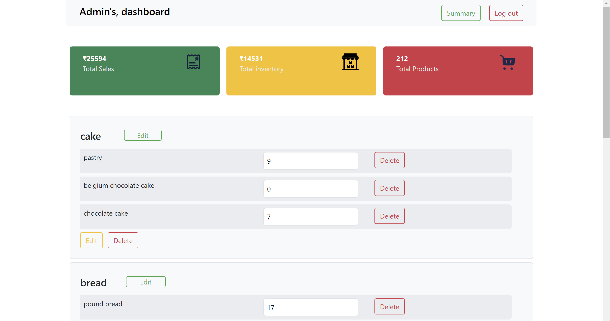
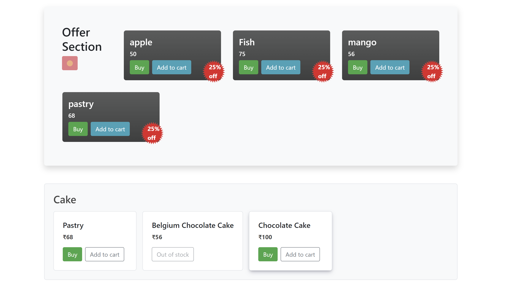
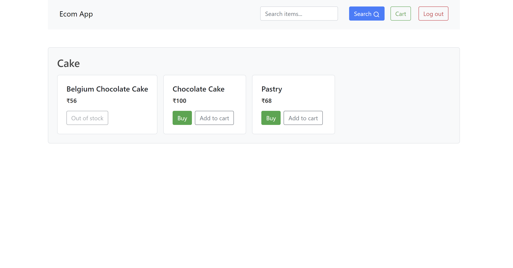

# Ecommerce-app
This is an online grocery store. There are two separate logins. One for the admin who has all the permission to edit inventory. The user login will authenticate the user based on email and password and take the user to the products page. From there the user can buy items in preferred quantity and also add products to the cart and buy all at once.


## Screenshots

<div style="display: flex;">
<div style="padding: 5px;">
    <h3>Landing Page</h3>
    
    <p>Describe the features or highlights of your landing page.</p>
</div>

<div style="padding: 5px;">
    <h3>Admin Dashboard</h3>
    
    <p>Showcase the functionalities available in the admin dashboard.</p>
</div>
</div>

<div style="display: flex;">
<div style="padding: 5px;">
    <h3>Products Page</h3>
    
    <p>Highlight the products page and its key features.</p>
</div>

<div style="padding: 5px;">
    <h3>Product Search Results Page</h3>
    
    <p>Show how users can interact with search results and find products.</p>
</div> 
</div>
 

## Features

- user authentication
- Seperate Login for user and admin
- user can add to cart or buy products
- admin can create category, add products or delete category
- seperate admin dashboard to track sales
- export data in csv files 


## How to Run?

To run this project you need to have python installed in your system. Then open the `commad line` and follow the following steps. 

### Run Locally : 
* create the virtual environment
```
 py -m venv env 

```  
* start the virtual environment by 
```
env\Scripts\activate
```

* install requirements 
```
pip install -r requirements.txt 
```
* run the main.py file 
```
py main.py 
```

New user can register but can't register as an admin, admin username and password is predefined.
```
username: admin-1
password: 1234
``` 

the app should be running in the --> http://localhost:8080/